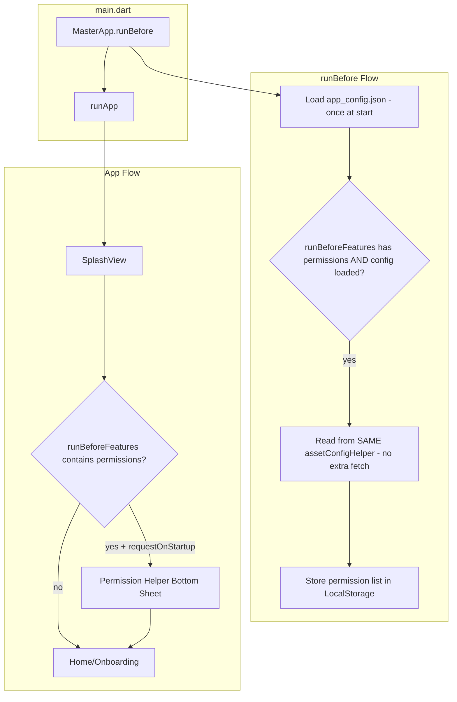

# Permission Helper - Native Platform Channel Implementation

## Summary

Create a **Permission Helper** that:

- Works on Android (Kotlin) and iOS (Swift) via platform channels (no Dart packages like `permission_handler`)
- Integrates with `MasterApp.runBefore()` via a `RunBeforeFeature` enum (array-style, similar to `NetworkInitFeature`)
- Reads `permissionsConfiguration` from `app_config.json` - when present, triggers the Permission Helper bottom sheet
- Runs after splash or native launch, showing permissions step-by-step to the user
- Uses Material widgets (per current codebase; osmea_components was migrated away)

---

## Architecture Overview




---

## 1. RunBeforeFeature Enum

Create `[lib/src/helper/run_before_feature.dart](lib/src/helper/run_before_feature.dart)` (new file):

- Enum `RunBeforeFeature` with value `permissions`
- When `permissions` is in the set passed to `MasterApp.runBefore(runBeforeFeatures: {...})`, and `permissionsConfiguration` in app_config has `requiredPermissions` or `optionalPermissions`, the Permission Helper flow is enabled

---

## 2. AssetConfigHelper - Add getList

Add to `[lib/src/helper/asset_config_helper.dart](lib/src/helper/asset_config_helper.dart)`:

```dart
List<String> getList(String key, [List<String> defaultValue = const []]) {
  final value = _getValue(key);
  if (value is List) {
    return value.map((e) => e.toString()).toList();
  }
  return defaultValue;
}
```

Used for `permissionsConfiguration.requiredPermissions` and `optionalPermissions`.

---

## 3. PermissionHelper (Dart) - Platform Channel

Create `[lib/src/helper/permission_helper/permission_helper.dart](lib/src/helper/permission_helper/permission_helper.dart)`:

- **No Dart packages** - uses `MethodChannel` only (like `AppTrackingTransparencyHelper`)
- Channel name: `com.masterfabric.permission_helper`
- Methods: `checkPermission(String permissionKey)`, `requestPermission(String permissionKey)`, `openAppSettings()`
- Returns `bool` for granted/denied

Create `[lib/src/helper/permission_helper/permission_type.dart](lib/src/helper/permission_helper/permission_type.dart)`:

- Enum `PermissionType` with values: `camera`, `location`, `locationWhenInUse`, `storage`, `photos`, `microphone`, `contacts`, `notification`
- Each maps to platform-specific strings (e.g. `camera` -> `android.permission.CAMERA`, `NSCameraUsageDescription` usage key)

---

## 4. Native iOS (Swift)

Extend `[ios/Classes/MasterfabricCorePlugin.swift](ios/Classes/MasterfabricCorePlugin.swift)`:

- Add a second `FlutterMethodChannel` for `com.masterfabric.permission_helper`, or register both channels in the same plugin
- Handle: `checkPermission`, `requestPermission`, `openAppSettings`
- Use `AVCaptureDevice`, `CLLocationManager`, `PHPhotoLibrary`, etc. for native permission APIs
- Map permission keys to iOS usage description keys (e.g. `camera` -> check `NSCameraUsageDescription` in Info.plist)

**Info.plist keys** (document in README):

- `NSCameraUsageDescription`
- `NSMicrophoneUsageDescription`
- `NSLocationWhenInUseUsageDescription`
- `NSPhotoLibraryUsageDescription`
- `NSContactsUsageDescription`

---

## 5. Native Android (Kotlin)

**Add Android platform** to `[pubspec.yaml](pubspec.yaml)`:

```yaml
flutter:
  plugin:
    platforms:
      ios:
        pluginClass: MasterfabricCorePlugin
      android:
        package: com.masterfabric.masterfabric_core
        pluginClass: MasterfabricCorePlugin
```

Create Android plugin structure:

- `android/src/main/kotlin/com/masterfabric/masterfabric_core/MasterfabricCorePlugin.kt`
- Implement `FlutterPlugin` and `ActivityAware` (needed for `ActivityCompat.requestPermissions`)
- Handle: `checkPermission`, `requestPermission`, `openAppSettings`
- Map permission keys to `Manifest.permission.*` (e.g. `camera` -> `Manifest.permission.CAMERA`)

**AndroidManifest.xml** (in consuming app - document in README):

- `android.permission.CAMERA`
- `android.permission.ACCESS_FINE_LOCATION`
- `android.permission.READ_EXTERNAL_STORAGE` / `READ_MEDIA_IMAGES` (API 33+)
- `android.permission.RECORD_AUDIO`
- `android.permission.READ_CONTACTS`

---

## 6. MasterApp.runBefore Integration (Correct Config Usage)

Modify `[lib/src/base/master_view/master_app.dart](lib/src/base/master_view/master_app.dart)`:

- Add parameter: `runBeforeFeatures: Set<RunBeforeFeature> = const {}`
- **Config is already loaded** at the start of runBefore via `assetConfigHelper.loadConfig()`. Do NOT fetch or load config again.
- **Read permissions from the same `assetConfigHelper`** instance, in the same runBefore block, AFTER config load succeeds.
- When `runBeforeFeatures.contains(RunBeforeFeature.permissions)` AND `assetConfigLoaded == true`:
  - Use `assetConfigHelper.getList('permissionsConfiguration.requiredPermissions')` and `getList('permissionsConfiguration.optionalPermissions')`
  - Use `assetConfigHelper.getBool('permissionsConfiguration.requestOnStartup', false)`
  - If `requestOnStartup` is true and combined permission list is non-empty:
    - Store permission list in `LocalStorageHelper` (e.g. `osmea_permissions_to_request`)
    - Set `osmea_permission_helper_pending` = true
- All config reads happen within the existing runBefore flow using the already-loaded config.

---

## 7. Permission Helper Bottom Sheet (Restylable for Apps)

Create `[lib/src/helper/permission_helper/permission_helper_bottom_sheet.dart](lib/src/helper/permission_helper/permission_helper_bottom_sheet.dart)`:

**Configurable styling** so each app can restyle the bottom sheet:

- `PermissionHelperBottomSheetConfig` class with:
  - `backgroundColor`, `primaryColor`, `textColor` (optional overrides)
  - `titleStyle`, `descriptionStyle` (optional TextStyle)
  - `builder` (optional `Widget Function(BuildContext, PermissionType, String rationale, VoidCallback onGrant, VoidCallback onSkip)?`) for fully custom UI per step
  - `grantButtonLabel`, `skipButtonLabel`, `notNowButtonLabel` (optional strings)
- Config can be passed when showing, or read from `permissionsConfiguration` in app_config (e.g. `permissionsConfiguration.bottomSheetStyle` with colors, labels)
- Default: use Material theme from context; apps override via config

**API:**

```dart
PermissionHelperBottomSheet.show(
  context,
  permissions: [...],
  onComplete: () {},
  config: PermissionHelperBottomSheetConfig(
    primaryColor: Colors.blue,
    builder: (context, permission, rationale, onGrant, onSkip) => MyCustomStep(...),
  ),
);
```

- Step-by-step UI: show one permission at a time with rationale text, "Grant" / "Skip" (optional) / "Not Now"
- On each step: call `PermissionHelper.instance.requestPermission(permission)`
- When all done: call `onComplete`, set `osmea_permission_helper_pending` = false

---

## 8. Splash / Launch Integration

Modify `[lib/src/views/splash/cubit/splash_cubit.dart](lib/src/views/splash/cubit/splash_cubit.dart)` or the router/shell:

- After splash completes (in `_determineNavigationTarget` or via a post-frame callback):
  - Check `LocalStorageHelper.getItem('osmea_permission_helper_pending')` == true
  - If true: show `PermissionHelperBottomSheet` before navigating to home/onboarding
  - Pass `onComplete` to navigate after permissions flow

Alternative: Use a wrapper widget in the app's root that checks `osmea_permission_helper_pending` and shows the bottom sheet on first frame after splash. This keeps splash logic simpler.

---

## 9. app_config.json Structure

Document and support in `[assets/app_config.json](assets/app_config.json)`:

```json
"permissionsConfiguration": {
  "requestOnStartup": true,
  "requiredPermissions": ["camera", "location", "photos"],
  "optionalPermissions": ["microphone", "contacts"],
  "bottomSheetStyle": {
    "primaryColor": "#2196F3",
    "backgroundColor": "#FFFFFF",
    "textColor": "#000000",
    "grantButtonLabel": "Allow",
    "skipButtonLabel": "Skip",
    "notNowButtonLabel": "Not Now"
  }
}
```

- Permission keys: `camera`, `location`, `locationWhenInUse`, `storage`, `photos`, `microphone`, `contacts`, `notification`
- `bottomSheetStyle` is optional; apps can restyle via config or pass `PermissionHelperBottomSheetConfig` at show-time

---

## 10. README Updates

Add section **"4e. Permission Helper (Platform Channel)"** to `[README.md](README.md)`:

- How to enable: `runBeforeFeatures: { RunBeforeFeature.permissions }`
- app_config structure (including optional `bottomSheetStyle` for restyling)
- **Restylable bottom sheet**: Pass `PermissionHelperBottomSheetConfig` or use `permissionsConfiguration.bottomSheetStyle` in app_config so each app can customize colors, labels, or provide a custom builder
- **iOS Info.plist** - list all required keys with example strings
- **Android AndroidManifest.xml** - list all `<uses-permission>` entries
- Flow: runBefore (reads config once) -> splash -> permission bottom sheet (step-by-step, restylable) -> home

---

## File Summary


| Action | Path                                                                                                              |
| ------ | ----------------------------------------------------------------------------------------------------------------- |
| Create | `lib/src/helper/run_before_feature.dart`                                                                          |
| Create | `lib/src/helper/permission_helper/permission_helper.dart`                                                         |
| Create | `lib/src/helper/permission_helper/permission_type.dart`                                                           |
| Create | `lib/src/helper/permission_helper/permission_helper_bottom_sheet.dart` (with `PermissionHelperBottomSheetConfig`) |
| Create | `android/src/main/kotlin/.../MasterfabricCorePlugin.kt`                                                           |
| Create | `android/build.gradle`, `android/src/main/AndroidManifest.xml` (plugin)                                           |
| Modify | `lib/src/helper/asset_config_helper.dart` - add getList                                                           |
| Modify | `lib/src/base/master_view/master_app.dart` - runBeforeFeatures, permission flow                                   |
| Modify | `ios/Classes/MasterfabricCorePlugin.swift` - add permission channel handlers                                      |
| Modify | `pubspec.yaml` - add android platform                                                                             |
| Modify | `lib/masterfabric_core.dart` or exports - export new helpers                                                      |
| Modify | `lib/src/views/splash/` or app shell - trigger permission bottom sheet                                            |
| Modify | `README.md` - Permission Helper section, Info.plist, AndroidManifest docs                                         |


---

## Notes

- **Config usage**: app_config is loaded once at the start of runBefore. Permissions config is read from the same `AssetConfigHelper` instance inside runBefore—no separate fetch or load.
- **Restylable bottom sheet**: Each app can customize the permission bottom sheet via `PermissionHelperBottomSheetConfig` (colors, labels, custom builder) or `permissionsConfiguration.bottomSheetStyle` in app_config.
- **Existing PermissionHandlerHelper** remains unchanged; it uses `permission_handler` package. The new **PermissionHelper** is a separate, package-free implementation for the startup flow.
- **osmea_components**: User rule says "always use osmea components" but the codebase migrated to Material (CHANGELOG). The bottom sheet will use Material widgets; if osmea_components is reintroduced, components can be swapped.
- **Example app**: Update `example/assets/app_config.json` with sample `permissionsConfiguration` and ensure example's Info.plist/AndroidManifest include the documented keys for testing.

